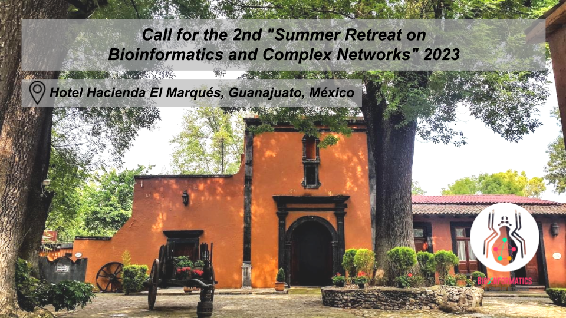
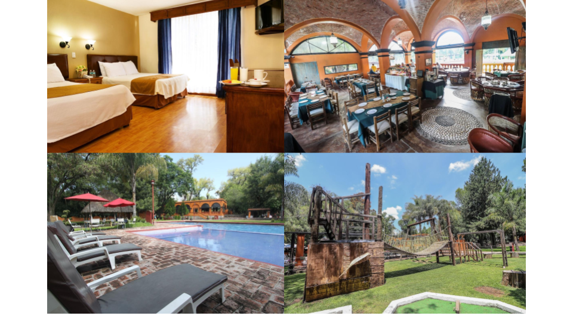
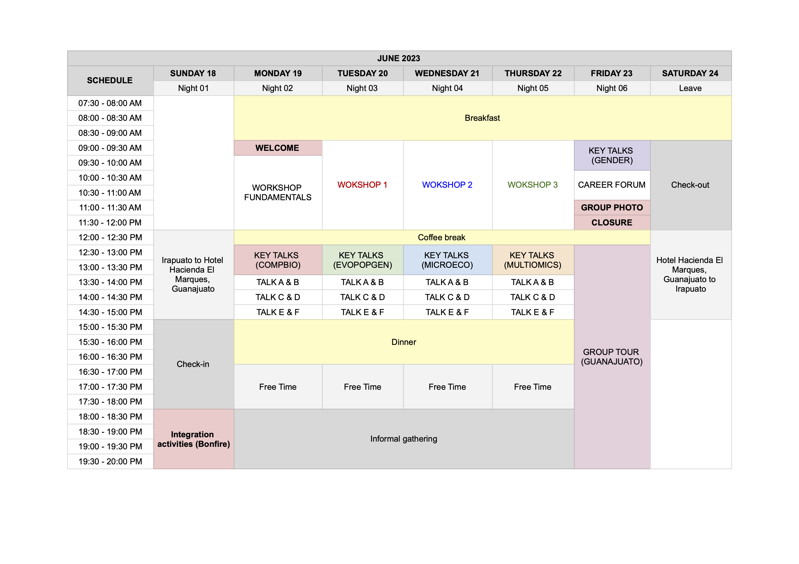
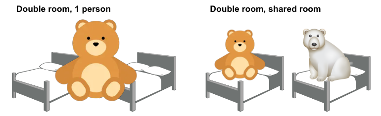

# Welcome to the info page for the 2nd *"Summer Retreat on Bioinformatics and Complex Networks"* 2023 !

We are delighted to announce that this event will take place from **June 18th to June 24th of the current year 2023**, at Hotel Hacienda el Marqués, located in Guanajuato, Mexico.

The **2nd Summer Retreat on Bioinformatics and Complex Networks** is a one-week experience of bioinformatics workshops, talks, and networking for a multidisciplinary scientific community sharing knowledge around biological topics.

This event is organized by the [Bioinformatics and Complex Networks Lab](https://ira.cinvestav.mx/ingenieriagenetica/dra-maribel-hernandez-rosales/bioinformatica-y-redes-complejas/) located at CINVESTAV Irapuato, Guanajuato. 

You can find a photograph registration of our past event in Twitter! @BioinfoComplexN

# Location

The event will take place at [Hotel Hacienda el Marqués](http://elmarqueshacienda.com.mx/)([Guanajuato Km. 11, 36263 Guanajuato, Gto.](https://goo.gl/maps/4Ai1HneigjXv45Am7?coh=178572&entry=tt)).

The hotel has multiple rooms however there are no single rooms available. The suggested room is a 2 bed-1 bath for one, two or more people (up to 4). If you're traveling alone and interested in the possibility of sharing a room with another attendee, please inform us at the registration form.

# Scientific Program & Workshops

It is desirable for every participant to present their scientific work. This is an excellent opportunity to share your scientific expertise and connect with people interested in your topic. If you're a member of the Bioinformatics & Complex Networks Lab, your presentation is mandatory. 

We have two kinds of talks: 

- **Regular talk:** 10 minutes talk + 5 minutes questions
- **Key talk (1 to 2 per day):** 25 minutes talk + 5 minutes questions 

A meaningful (*preliminary*) title should be given during registration to schedule talk sessions. As expected, we will provide a video projector (with VGA & HDMI ports) and a laser pointer for the presentations. 

Preliminary schedule of our scientific program. *Definitive information on the schedule will be given soon.*

Further information on the workshops will be given at time. 

# Fee
Fee modality.

| Room capacity                        | Price per day per person (MNX) | Whole week per person (MNX) |
| ----------------------               | -------------------------------| --------------------------- |
| Double room, 1 person                | $ 850                          | $ 5,100                     |
| Double room, 2 people | $ 425                          | $ 2,550                     |

**Notes and considerations:** 

- The conference fee includes accommodation at Hotel Hacienda el Marqués and breakfast. 
- Meals (lunch and dinner) are not included in the program fee. However, joint outings are organized to engage in group activities, but you are responsible for covering your own meal expenses during the program.
- After your registration, you will receive an email with **payment details** in case you want to stay at Hotel Hacienda el Marqués. 
- The conference fee can only be refunded if the registration is canceled by the end of the registration deadline on June 10th (per e-mail). Otherwise, your payment will not be refunded.
- While attendees are kindly asked to take care of their own travel arrangements, we want to assure you that we are here to assist you with any further instructions or guidance you may need upon your arrival at the hotel. Please don't hesitate to reach out to us.

# Family

Your family is welcome to join us in Guanajuato! 

We understand that each family's needs may vary based on the number of children and/or including pets. If it would be more convenient for you, we are more than happy to make separate accommodations for families and individuals attending the lecture hall. If this applies to your situation, please inform the organizing committee, and we will gladly provide personalized assistance to ensure you and your family comfort and satisfaction.

# Registration form

Please [fill out this form](https://docs.google.com/forms/d/1nxQhFYKsHHbI6D79y58BdpDmJk9jXzfjUHP9NIx5BBU/edit?ts=6478dd40) to register your attendance. 

**Deadline for registration June 10th.**

# Check-in

Check-in will be at Hotel Hacienda el Marqués reception on from 3 pm to 6 pm. If you are arriving before registration, please contact and wait for the organizing committee. Note that late-night registration will not be supported after 8 pm, even for those running late. 

# Further information

- **Cash:**  Hotel Hacienda el Marqués takes credit/debit cards. 
- **Internet:** WIFI is available in Hotel Hacienda el Marqués but might not cover all rooms equally.

# 2023 Organizing comittee**
MSc student Marisol Navarro-Miranda,
MSc student Luis F. Hernández,
PhD Katia Aviña-Padilla.
Feel free to contact us via mail if you have any inquiry: **bioinfoandcomplexnetworks@gmail.com**

